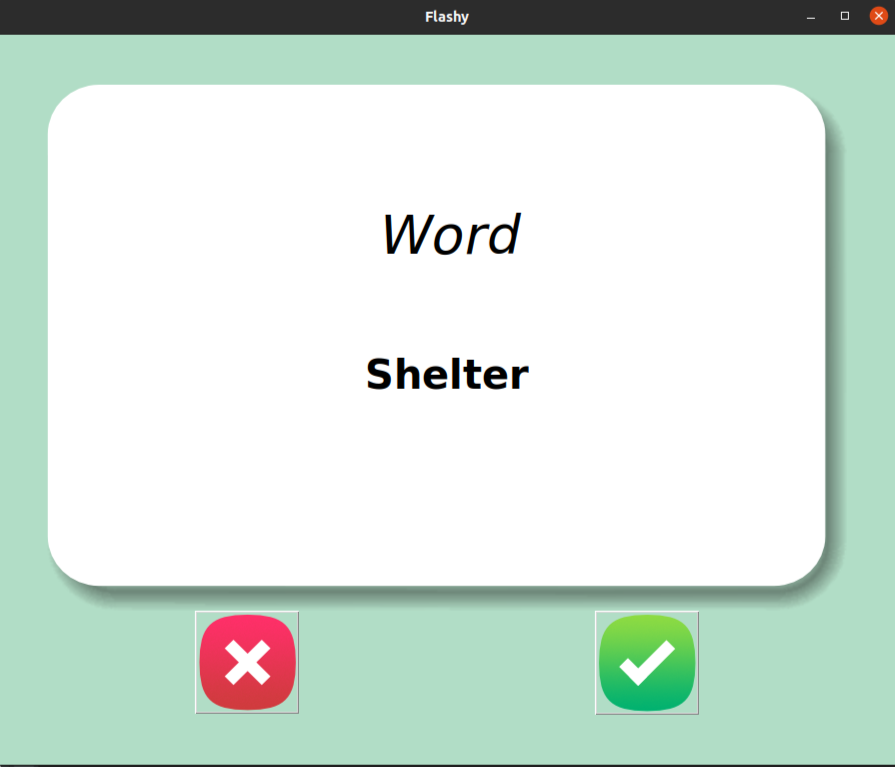

# The 327 must know TOEFL words

Developing solid TOEFL vocabulary skills can be one of the most challenging parts of studying for the exam, but it’s also one of the most important.
Many TOEFL questions either ask the definition of a word outright or require you to have knowledge of certain words in order to answer a question correctly. With so many words in the English language, I decided to create a small project to apply what i've just learned (tkinter) into a helpful project for my TOEFL preperation 

## Python GUI

I took a a table of TOEFL vocabulary list online, tried to clean the data and convert it from a .txt file to a .csv file using what I just learned recently. Than, I used the Tkinter Python library to design an easy, responsive GUI that allows the user to show a random word from the list and its explanation after 4 seconds. Finally, the user can either click on the check button which means that the user already knows the word so it gets removed from the full list (it won't show up even if the user restarts the GUI) or click on the cross button to skip to the next word (the user doesn't know the word)

## Screenshots

## Acknowledgements

  <a href="https://quizlet.com/in/518132773/prepscholar-327-toefl-flash-cards/">Prepscholar 327 TOEFL flashcards</a>
  <a href="https://github.com/aymenkrifa/TOEFL-must-know-word-flashcards/blob/main/data/toefl_must_known_words.csv">TOEFL must-know words full list in a CSV format</a>

## 🚀 About Me
I am currently a senior year Computer Science undergraduate student at Ecole Polytechnique Sousse.

I have a passion for learning and developing new skills related to computer science and other related fields since my final year of high school and have ever since been gradually growing my knowledge in these topics and learning as much as I can! With time I built a strong sense of curiosity, and a love for problem-solving.

I am currently a Deputy Secretary General of Creative Leaders, a university (EPS) club that aims to enhance the capabilities of the youth in the field of entrepreneurship through projects and business strategies.

In my spare time, I like to take my camera outside and shoot landscapes. You can have a look at my new <a href=http://vsco.com/aymen-krifa>VSCO page</a>
## 🔗 Links

